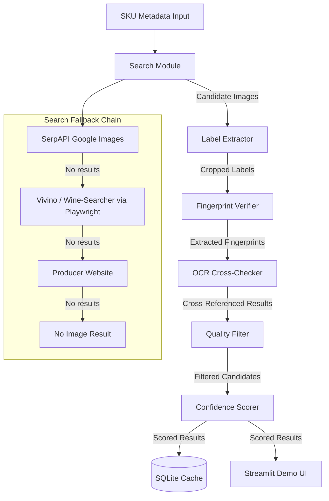

# Design Document: Wine Photo Pipeline

## Overview

The Wine Photo Pipeline is a Python async application that automates sourcing and verifying wine product photos for VinoBuzz's 4,000+ SKU catalog. The pipeline processes each SKU through five sequential stages: multi-source image search, label region extraction, structured fingerprint verification with OCR cross-reference, image quality filtering, and confidence scoring. The system targets 90%+ accuracy by using field-by-field label verification rather than holistic image similarity.

The architecture follows a linear pipeline pattern where each stage transforms or filters data before passing it to the next. Results are cached in SQLite to avoid redundant API calls. A Streamlit demo UI provides visual inspection of per-SKU results.

## Architecture



The pipeline processes candidates in a funnel pattern: search produces many candidates, each subsequent stage narrows the set, and the confidence scorer picks the best verified result.

### Processing Flow Per SKU

1. Check SQLite cache — return cached result if present (unless bypass requested)
2. Search Module queries sources in fallback order, collecting candidate image URLs
3. For each candidate: download image, run Label Extractor to crop label region
4. For each cropped label: run Fingerprint Verifier (GPT-4o) to extract structured fields
5. For each fingerprint: run OCR Cross-Checker (Google Vision) to cross-reference
6. For each candidate still alive: run Quality Filter to reject non-compliant images
7. Confidence Scorer computes per-dimension scores, picks best candidate, assigns verdict
8. Store result in SQLite cache
9. Return result (JSON with scores, verdict, image URL or "No Image")

## Components and Interfaces

### 1. SKU Model

Represents the input wine product metadata.

```python
@dataclass
class SKU:
    id: str
    producer: str
    appellation: str
    cru_vineyard: str | None
    vintage: int | None  # None for NV wines
    format: str  # e.g., "750ml"
    region: str
```

### 2. Search Module

Responsible for finding candidate images from multiple sources.

```python
class SearchModule:
    async def search(self, sku: SKU) -> list[CandidateImage]:
        """Execute fallback chain: SerpAPI → Retailers → Producer site → No Image."""
        ...

    async def _search_serpapi(self, sku: SKU) -> list[CandidateImage]: ...
    async def _search_retailers(self, sku: SKU) -> list[CandidateImage]: ...
    async def _search_producer_site(self, sku: SKU) -> list[CandidateImage]: ...
```

Uses `httpx.AsyncClient` for SerpAPI calls and `playwright.async_api` for retailer scraping. Constructs search queries from SKU fields (producer + appellation + cru + vintage + "wine bottle photo").

### 3. Label Extractor

Crops the label region from bottle images using OpenCV.

```python
class LabelExtractor:
    def extract_label(self, image: bytes) -> LabelExtractionResult:
        """Detect and crop label region using OpenCV contour detection."""
        ...
```

Algorithm:
1. Convert to grayscale
2. Apply Gaussian blur and adaptive thresholding
3. Find contours, filter by area and aspect ratio for label-like rectangles
4. Crop the largest qualifying contour region
5. If no qualifying contour found, return full image with `label_detected=False`

### 4. Fingerprint Verifier

Extracts structured label data via GPT-4o vision and compares against SKU metadata.

```python
class FingerprintVerifier:
    async def verify(self, label_image: bytes, sku: SKU) -> VerificationResult:
        """Extract fingerprint via GPT-4o and compare field-by-field."""
        ...

    async def _extract_fingerprint(self, label_image: bytes) -> Fingerprint:
        """Call GPT-4o vision to extract structured label fields."""
        ...

    def _compare_fields(self, fingerprint: Fingerprint, sku: SKU) -> FieldScores:
        """Field-by-field fuzzy string comparison."""
        ...
```

Field comparison uses normalized Levenshtein distance (via `rapidfuzz`) for fuzzy matching. Each field produces a score between 0.0 and 1.0. For NV wines (vintage is None), the vintage field is skipped and its weight redistributed.

### 5. OCR Cross-Checker

Independent text extraction via Google Cloud Vision for cross-referencing.

```python
class OCRCrossChecker:
    async def check(self, label_image: bytes, fingerprint: Fingerprint) -> OCRResult:
        """Extract text via Google Vision OCR and cross-reference against fingerprint."""
        ...
```

Sends image to `asia-east2` endpoint. Parses raw OCR text to find tokens matching producer, appellation, cru, and vintage. Reports agreement/disagreement per field.

### 6. Quality Filter

Evaluates image quality against VinoBuzz photo standards.

```python
class QualityFilter:
    async def evaluate(self, image: bytes) -> QualityResult:
        """Check image against quality criteria using GPT-4o vision."""
        ...
```

Uses GPT-4o vision with a structured prompt to evaluate: watermarks, blur/glare, single upright bottle, white/grey background, no lifestyle props, not AI-generated. Returns pass/fail with specific rejection reasons.

### 7. Confidence Scorer

Computes weighted scores and assigns three-tier verdict.

```python
class ConfidenceScorer:
    def score(
        self,
        field_scores: FieldScores,
        ocr_result: OCRResult,
        quality_result: QualityResult,
        label_detected: bool,
    ) -> ScoredResult:
        """Compute per-dimension and overall confidence, assign verdict."""
        ...
```

Default weights (adjustable):
- producer_match: 0.30
- appellation_match: 0.25
- cru_match: 0.20
- vintage_match: 0.15
- image_quality: 0.10

For NV wines, vintage weight (0.15) is redistributed proportionally across producer, appellation, and cru.

Verdict thresholds:
- overall_confidence ≥ 0.85 → PASS
- 0.60 ≤ overall_confidence < 0.85 → QUARANTINE
- overall_confidence < 0.60 → REJECT

### 8. Cache Layer

SQLite-based result caching.

```python
class ResultCache:
    def get(self, sku_id: str) -> ScoredResult | None: ...
    def put(self, sku_id: str, result: ScoredResult) -> None: ...
    def invalidate(self, sku_id: str) -> None: ...
```

### 9. Pipeline Orchestrator

Wires all components together and manages the per-SKU processing flow.

```python
class Pipeline:
    async def process_sku(self, sku: SKU, bypass_cache: bool = False) -> ScoredResult:
        """Run full pipeline for a single SKU."""
        ...

    async def process_batch(self, skus: list[SKU], bypass_cache: bool = False) -> list[ScoredResult]:
        """Process multiple SKUs concurrently."""
        ...
```

### 10. Streamlit Demo UI

Single-page Streamlit app that:
- Displays a table of all processed SKUs with verdict and overall confidence
- Provides per-SKU detail view: raw image → cropped label → fingerprint → scores
- Has buttons to run pipeline on test SKUs and reference SKUs
- Shows summary accuracy metrics

## Data Models

```python
from dataclasses import dataclass
from enum import Enum


class Verdict(Enum):
    PASS = "PASS"
    QUARANTINE = "QUARANTINE"
    REJECT = "REJECT"


@dataclass
class CandidateImage:
    url: str
    source: str  # "serpapi", "vivino", "wine-searcher", "producer", etc.
    raw_image: bytes | None = None


@dataclass
class LabelExtractionResult:
    cropped_image: bytes
    label_detected: bool  # False if full image was returned as fallback


@dataclass
class Fingerprint:
    producer: str | None
    appellation: str | None
    cru_vineyard: str | None
    vintage: str | None


@dataclass
class FieldScores:
    producer_match: float  # 0.0 to 1.0
    appellation_match: float
    cru_match: float
    vintage_match: float  # 0.0 for NV wines (weight redistributed)


@dataclass
class OCRResult:
    raw_text: str
    producer_confirmed: bool
    appellation_confirmed: bool
    cru_confirmed: bool
    vintage_confirmed: bool
    fields_disagreed: list[str]  # field names where OCR contradicts GPT-4o


@dataclass
class QualityResult:
    passed: bool
    image_quality_score: float  # 0.0 to 1.0
    rejection_reasons: list[str]  # empty if passed


@dataclass
class ScoredResult:
    sku_id: str
    image_url: str | None  # None if "No Image"
    producer_match: float
    appellation_match: float
    cru_match: float
    vintage_match: float
    image_quality: float
    overall_confidence: float
    verdict: Verdict
    fingerprint: Fingerprint | None
    rejection_reasons: list[str]

    def to_json(self) -> dict:
        """Serialize to JSON-compatible dict."""
        ...
```

### SQLite Cache Schema

```sql
CREATE TABLE IF NOT EXISTS pipeline_results (
    sku_id TEXT PRIMARY KEY,
    image_url TEXT,
    producer_match REAL,
    appellation_match REAL,
    cru_match REAL,
    vintage_match REAL,
    image_quality REAL,
    overall_confidence REAL,
    verdict TEXT,
    fingerprint_json TEXT,
    rejection_reasons_json TEXT,
    created_at TIMESTAMP DEFAULT CURRENT_TIMESTAMP,
    updated_at TIMESTAMP DEFAULT CURRENT_TIMESTAMP
);
```


## Correctness Properties

*A property is a characteristic or behavior that should hold true across all valid executions of a system — essentially, a formal statement about what the system should do. Properties serve as the bridge between human-readable specifications and machine-verifiable correctness guarantees.*

### Property 1: Fallback chain always starts with SerpAPI

*For any* SKU submitted to the Search_Module, the first source queried SHALL be SerpAPI (Google Images), regardless of the SKU's metadata content.

**Validates: Requirements 1.1**

### Property 2: Exhausted fallback chain produces "No Image"

*For any* SKU where all sources in the fallback chain (SerpAPI, retailers, producer site) return zero candidate images, the Search_Module SHALL return a result with no image URL and a "No Image" designation.

**Validates: Requirements 1.4**

### Property 3: Undetected label contour returns full image

*For any* image where OpenCV contour detection finds no qualifying label region, the Label_Extractor SHALL return the full original image with `label_detected=False`.

**Validates: Requirements 2.2**

### Property 4: Fingerprint extraction always produces all four fields

*For any* GPT-4o vision response parsed by the Fingerprint_Verifier, the resulting Fingerprint object SHALL contain all four fields (producer, appellation, cru_vineyard, vintage), each being either a string value or None.

**Validates: Requirements 3.1**

### Property 5: Field comparison scores are bounded and identity-correct

*For any* pair of non-empty strings, the field comparison function SHALL return a score in [0.0, 1.0]. *For any* string compared against itself, the score SHALL be 1.0.

**Validates: Requirements 3.2**

### Property 6: NV wine scoring redistributes vintage weight

*For any* SKU with vintage=None (NV wine), the Confidence_Scorer SHALL exclude the vintage_match dimension and redistribute its weight proportionally so that all remaining weights sum to 1.0.

**Validates: Requirements 3.3**

### Property 7: OCR agreement boosts and disagreement reduces field scores

*For any* field where the OCR_Cross_Checker confirms the GPT-4o Fingerprint value, the final field score SHALL be greater than or equal to the base field score. *For any* field where the OCR_Cross_Checker contradicts the GPT-4o Fingerprint value, the final field score SHALL be less than the base field score.

**Validates: Requirements 3.4, 4.3, 4.4**

### Property 8: OCR text parsing extracts known embedded tokens

*For any* raw OCR text string that contains a known producer or appellation substring, the OCR parser SHALL identify and return that substring as a matched token.

**Validates: Requirements 4.2**

### Property 9: Rejected images always have non-empty rejection reasons

*For any* QualityResult where `passed=False`, the `rejection_reasons` list SHALL contain at least one non-empty string describing the specific rejection cause.

**Validates: Requirements 5.7**

### Property 10: All dimension scores are bounded in [0.0, 1.0]

*For any* ScoredResult produced by the Confidence_Scorer, each of producer_match, appellation_match, cru_match, vintage_match, and image_quality SHALL be in the range [0.0, 1.0].

**Validates: Requirements 6.1**

### Property 11: Overall confidence equals weighted sum of dimension scores

*For any* set of dimension scores and scoring weights, the overall_confidence SHALL equal the weighted sum of the individual dimension scores (within floating-point tolerance of 1e-9).

**Validates: Requirements 6.2**

### Property 12: Verdict thresholds are correctly applied

*For any* overall_confidence value, the assigned Verdict SHALL be PASS if overall_confidence ≥ 0.85, QUARANTINE if 0.60 ≤ overall_confidence < 0.85, and REJECT if overall_confidence < 0.60.

**Validates: Requirements 6.3, 6.4, 6.5**

### Property 13: ScoredResult JSON round-trip

*For any* valid ScoredResult object, serializing it to JSON via `to_json()` and then deserializing back SHALL produce an equivalent ScoredResult object.

**Validates: Requirements 6.6**

### Property 14: Cache store/retrieve round-trip

*For any* valid ScoredResult stored in the Cache, retrieving it by the same SKU ID SHALL return an equivalent ScoredResult (within timestamp tolerance).

**Validates: Requirements 7.1**

### Property 15: Cached SKU returns without re-executing pipeline stages

*For any* SKU that has a cached result and is processed without cache bypass, the Pipeline SHALL return the cached result and SHALL NOT invoke the Search_Module, Label_Extractor, Fingerprint_Verifier, or any other pipeline stage.

**Validates: Requirements 7.2**

### Property 16: Summary metrics correctly count verdicts

*For any* list of ScoredResults, the summary accuracy computation SHALL produce counts for PASS, QUARANTINE, and REJECT that sum to the total number of results, and each percentage SHALL equal its count divided by the total.

**Validates: Requirements 8.4**

## Error Handling

### External API Failures

- **SerpAPI timeout/error**: Log the error, skip to next source in fallback chain. Do not fail the entire SKU.
- **GPT-4o API error**: Retry once with exponential backoff. If still failing, mark the candidate as unverifiable and move to next candidate. If no candidates remain, return "No Image".
- **Google Vision OCR error**: Log the error, proceed without OCR cross-reference. Reduce confidence slightly since secondary verification is missing.
- **Playwright scraping failure**: Log the error, skip the retailer source and continue to next source in fallback chain.

### Image Processing Failures

- **Image download failure** (broken URL, 404, timeout): Skip the candidate, log the URL and error, continue with remaining candidates.
- **OpenCV processing error** (corrupt image, unsupported format): Skip the candidate, log the error. Do not crash the pipeline.
- **Label extraction produces empty/tiny crop**: Fall back to full image with `label_detected=False`.

### Data Integrity

- **SQLite write failure**: Log the error, return the result to the caller without caching. The next run will re-process.
- **SQLite read failure**: Log the error, proceed as if no cache exists (re-execute pipeline).
- **Malformed GPT-4o response** (missing fields, invalid JSON): Parse what is available, set missing fields to None, reduce confidence for unparseable fields.

### Rate Limiting

- **SerpAPI rate limit**: Implement request throttling. If rate-limited, wait and retry. If persistent, skip to next source.
- **GPT-4o rate limit**: Queue requests with concurrency limits (max 5 concurrent). Retry with backoff.
- **Google Vision quota exceeded**: Log warning, proceed without OCR cross-reference for remaining SKUs in batch.

## Testing Strategy

### Unit Tests

Unit tests cover specific examples, edge cases, and error conditions:

- **Field comparison**: Test known string pairs (exact match, partial match, completely different, empty strings, Unicode/accented characters like "Grèves")
- **Verdict assignment**: Test boundary values (0.59, 0.60, 0.84, 0.85, 0.0, 1.0)
- **NV wine handling**: Test that vintage field is skipped and weights redistribute correctly for a specific NV SKU
- **OCR text parsing**: Test with known OCR output strings containing wine terms
- **Quality filter rejection reasons**: Test that specific rejection scenarios produce the correct reason strings
- **Cache operations**: Test store, retrieve, invalidate, and cache-miss scenarios
- **JSON serialization**: Test specific ScoredResult instances serialize/deserialize correctly
- **Label extractor fallback**: Test with an image that has no detectable contours

### Property-Based Tests

Property-based tests validate universal properties across randomly generated inputs. Use `hypothesis` as the property-based testing library for Python.

Each property test:
- Runs a minimum of 100 iterations
- References its design document property number
- Is tagged with: **Feature: wine-photo-pipeline, Property {N}: {title}**

Properties to implement:
1. Field comparison scores bounded and identity-correct (Property 5)
2. NV wine weight redistribution sums to 1.0 (Property 6)
3. OCR agreement/disagreement adjusts scores directionally (Property 7)
4. Rejected images have non-empty reasons (Property 9)
5. Dimension scores bounded in [0.0, 1.0] (Property 10)
6. Overall confidence equals weighted sum (Property 11)
7. Verdict thresholds correctly applied (Property 12)
8. ScoredResult JSON round-trip (Property 13)
9. Cache store/retrieve round-trip (Property 14)
10. Summary metrics count correctly (Property 16)

Properties 1-4, 8, and 15 are better tested as integration tests with mocked dependencies rather than pure property-based tests, since they involve component interaction and external API behavior.

### Integration Tests

- **Fallback chain order**: Mock all sources, verify SerpAPI is called first, then retailers, then producer site
- **End-to-end pipeline**: Mock external APIs, run a SKU through the full pipeline, verify all stages execute in order
- **Cache bypass**: Store a result, process with bypass=True, verify pipeline re-executes
- **Batch processing**: Process multiple SKUs concurrently, verify all complete without interference

### Test Configuration

```python
# conftest.py
from hypothesis import settings

settings.register_profile("ci", max_examples=200)
settings.register_profile("dev", max_examples=100)
settings.load_profile("dev")
```
