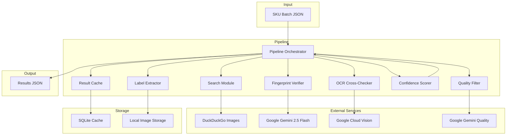

# Design Document: Wine Photo Pipeline

## Overview

The wine photo pipeline is an automated system that processes wine SKUs by searching for images, extracting labels, reading text via OCR, and cross-checking against SKU metadata. The system handles batch processing of up to 100 SKUs, caches results in SQLite, and returns matched images with confidence scores or placeholders when no match is found.

The pipeline uses multiple OCR sources (Google Gemini 2.5 Flash and Google Cloud Vision) for robust text extraction, performs field-by-field fuzzy matching, and evaluates image quality to ensure reliable results. All components are orchestrated through a single pipeline class that coordinates search, extraction, verification, and scoring.

## Architecture



## Components and Interfaces

### Pipeline Orchestrator

The `Pipeline` class coordinates all pipeline stages:

- `process_sku(sku, bypass_cache)`: Process a single SKU through the full pipeline
- `process_batch(skus, bypass_cache, max_concurrency)`: Process multiple SKUs concurrently

### Search Module

The `SearchModule` class implements a fallback chain for image search:

- `_build_query(sku)`: Construct search query from SKU metadata
- `_search_ddg(sku)`: Search DuckDuckGo Images (primary source)
- `_search_retailers(sku)`: Scrape Vivino and Wine-Searcher (fallback)
- `_search_producer_site(sku)`: Search producer website (final fallback)
- `search(sku)`: Execute full fallback chain, return up to 3 candidates

### Label Extractor

The `LabelExtractor` class uses OpenCV for label detection:

- `extract_label(image)`: Detect and crop label region using contour detection
- Algorithm: grayscale → blur → adaptive threshold → contour detection → filter by area/aspect ratio → crop

### Fingerprint Verifier

The `FingerprintVerifier` class extracts structured label data:

- `_extract_fingerprint(image)`: Call Gemini vision API for structured extraction
- `_parse_fingerprint(text)`: Parse Gemini JSON response into Fingerprint object
- `_compare_fields(fingerprint, sku)`: Compare each field against SKU metadata using cross-field matching
- Returns VerificationResult with fingerprint, field scores, and NV flag

### OCR Cross-Checker

The `OCRCrossChecker` class validates OCR results:

- `_extract_text(image)`: Call Google Cloud Vision OCR
- `_cross_reference(text, fingerprint)`: Compare Cloud Vision results against Gemini fingerprint
- Returns OCRResult with confirmed/disagreed fields

### Quality Filter

The `QualityFilter` class evaluates image quality:

- `evaluate(image)`: Send image to Gemini for quality assessment
- Parses JSON response with 6 criteria: watermarks, blur_glare, single_upright_bottle, background, no_lifestyle_props, not_ai_generated
- Returns QualityResult with pass/fail status and rejection reasons

### Confidence Scorer

The `ConfidenceScorer` class computes overall confidence:

- `score(field_scores, ocr_result, quality_result, label_detected, is_nv)`: Compute weighted confidence
- Weights: producer (35%), appellation (25%), cru (15%), vintage (15%), quality (10%)
- For NV wines, redistribute vintage weight to other fields
- OCR adjustment: +5% boost for confirmed fields, -5% penalty for disagreements
- Verdict assignment: PASS (≥70%), QUARANTINE (50-70%), REJECT (<50%)

### Result Cache

The `ResultCache` class provides SQLite-based caching:

- `get(sku_id)`: Retrieve cached result
- `put(sku_id, result)`: Store or update result
- `invalidate(sku_id)`: Remove cached result
- `_serialize_fingerprint(fp)`: Convert Fingerprint to JSON string
- `_deserialize_fingerprint(fp_json)`: Parse JSON string to Fingerprint

## Data Models

### SKU

```python
@dataclass
class SKU:
    id: str
    producer: str
    appellation: str
    cru_vineyard: Optional[str]
    vintage: Optional[int]  # None for NV wines
    format: str  # e.g., "750ml"
    region: str
```

### CandidateImage

```python
@dataclass
class CandidateImage:
    url: str
    source: str  # "duckduckgo", "vivino", "wine-searcher", "producer"
    raw_image: Optional[bytes] = None
```

### LabelExtractionResult

```python
@dataclass
class LabelExtractionResult:
    cropped_image: bytes
    label_detected: bool  # False if full image was returned as fallback
```

### Fingerprint

```python
@dataclass
class Fingerprint:
    producer: Optional[str]
    appellation: Optional[str]
    cru_vineyard: Optional[str]
    vintage: Optional[str]
```

### FieldScores

```python
@dataclass
class FieldScores:
    producer_match: float  # 0.0 to 1.0
    appellation_match: float
    cru_match: float
    vintage_match: float  # 0.0 for NV wines
```

### OCRResult

```python
@dataclass
class OCRResult:
    raw_text: str
    producer_confirmed: bool
    appellation_confirmed: bool
    cru_confirmed: bool
    vintage_confirmed: bool
    fields_disagreed: list  # field names where OCR contradicts Gemini
```

### QualityResult

```python
@dataclass
class QualityResult:
    passed: bool
    image_quality_score: float  # 0.0 to 1.0
    rejection_reasons: list  # empty if passed
```

### ScoredResult

```python
@dataclass
class ScoredResult:
    sku_id: str
    image_url: Optional[str]  # None if "No Image"
    producer_match: float
    appellation_match: float
    cru_match: float
    vintage_match: float
    image_quality: float
    overall_confidence: float
    verdict: Verdict  # PASS, QUARANTINE, REJECT
    fingerprint: Optional[Fingerprint]
    rejection_reasons: list  # from quality filter
```

## Correctness Properties

A property is a characteristic or behavior that should hold true across all valid executions of a system-essentially, a formal statement about what the system should do. Properties serve as the bridge between human-readable specifications and machine-verifiable correctness guarantees.

### Property-Based Testing Overview

Property-based testing (PBT) validates software correctness by testing universal properties across many generated inputs.
Each property is a formal specification that should hold for all valid inputs.

### Core Principles

1. **Universal Quantification**: Every property must contain an explicit "for all" statement
2. **Requirements Traceability**: Each property must reference the requirements it validates
3. **Executable Specifications**: Properties must be implementable as automated tests
4. **Comprehensive Coverage**: Properties should cover all testable acceptance criteria

### Property Reflection

After completing the initial prework analysis, I've reviewed all properties and identified the following:

**Redundancy Analysis:**
- Properties 1.1, 1.2, 1.3, 1.4 are all related to batch processing and can be tested together
- Properties 2.1, 2.2, 2.3, 2.4 are all related to search functionality and can be tested together
- Properties 3.1, 3.2, 3.3, 3.4 are all related to label extraction and can be tested together
- Properties 4.1, 4.2, 4.3, 4.4 are all related to OCR extraction and can be tested together
- Properties 5.1, 5.2, 5.3, 5.4 are all related to OCR cross-checking and can be tested together
- Properties 6.1, 6.2, 6.3, 6.4 are all related to field comparison and can be tested together
- Properties 7.1, 7.2, 7.3, 7.4 are all related to quality filtering and can be tested together
- Properties 8.1, 8.2, 8.3, 8.4, 8.5, 8.6, 8.7 are all related to confidence scoring and can be tested together
- Properties 9.1, 9.2, 9.3, 9.4 are all related to caching and can be tested together
- Properties 10.1, 10.2, 10.3, 10.4 are all related to output generation and can be tested together
- Properties 11.1, 11.2, 11.3, 11.4 are all related to CLI execution and can be tested together
- Properties 12.1, 12.2, 12.3, 12.4 are all related to error handling and can be tested together

**Consolidated Properties:**
- Batch processing properties can be combined into a single comprehensive property
- Search functionality properties can be combined into a single comprehensive property
- Label extraction properties can be combined into a single comprehensive property
- OCR extraction properties can be combined into a single comprehensive property
- OCR cross-checking properties can be combined into a single comprehensive property
- Field comparison properties can be combined into a single comprehensive property
- Quality filtering properties can be combined into a single comprehensive property
- Confidence scoring properties can be combined into a single comprehensive property
- Caching properties can be combined into a single comprehensive property
- Output generation properties can be combined into a single comprehensive property
- CLI execution properties can be combined into a single comprehensive property
- Error handling properties can be combined into a single comprehensive property

### Correctness Properties

Property 1: Batch processing preserves order and handles size limits
*For any* batch of SKUs, processing the batch should return results in the same order as input, process all SKUs in batches up to 100, process only the first 100 SKUs in larger batches, and return results for all processed SKUs
**Validates: Requirements 1.1, 1.2, 1.3, 1.4**

Property 2: Search fallback chain returns candidates or empty list
*For any* SKU, the search module should return up to 3 candidate images from DuckDuckGo, Vivino, Wine-Searcher, or producer site in that order, or return an empty list if no candidates are found
**Validates: Requirements 2.1, 2.2, 2.3, 2.4**

Property 3: Label extraction returns cropped label or full image fallback
*For any* wine bottle image, the label extractor should return a cropped label image when a label is detected, or return the full image with label_detected=False when no label is found
**Validates: Requirements 3.1, 3.2, 3.3, 3.4**

Property 4: OCR extraction returns structured fields with cross-check validation
*For any* label image, the OCR system should extract structured fields (producer, appellation, cru, vintage) from Gemini 2.5 Flash, fall back to Cloud Vision if Gemini fails, and cross-check results to identify confirmed and disagreed fields
**Validates: Requirements 4.1, 4.2, 4.3, 4.4**

Property 5: Field comparison uses fuzzy matching with cross-field fallback
*For any* fingerprint and SKU, the field comparison should calculate match scores using fuzzy string matching, assign 0.0 for missing fields, and use cross-field matching when direct matches fail
**Validates: Requirements 6.1, 6.2, 6.3, 6.4**

Property 6: Quality evaluation checks all criteria and returns rejection reasons
*For any* candidate image, the quality filter should evaluate watermarks, blur/glare, single upright bottle, background, lifestyle props, and AI generation, returning a quality score and rejection reasons for any failed criteria
**Validates: Requirements 7.1, 7.2, 7.3, 7.4**

Property 7: Confidence scoring combines weighted fields with OCR adjustment
*For any* set of field scores, OCR results, and quality results, the confidence scorer should calculate overall confidence as a weighted combination of producer (35%), appellation (25%), cru (15%), vintage (15%), and quality (10%), with OCR boost (+5%) for confirmed fields and OCR penalty (-5%) for disagreements
**Validates: Requirements 8.1, 8.2, 8.3, 8.4, 8.5, 8.6, 8.7**

Property 8: Caching stores and retrieves results correctly
*For any* SKU result, the cache should store the result in SQLite, retrieve it on subsequent requests for the same SKU, bypass cache when requested, and continue processing if cache storage fails
**Validates: Requirements 9.1, 9.2, 9.3, 9.4**

Property 9: Output generation includes all required fields
*For any* SKU result, the output should include SKU ID, image URL (or None for no match), field scores, overall confidence, verdict (PASS/QUARANTINE/REJECT), fingerprint (or None), and rejection reasons
**Validates: Requirements 10.1, 10.2, 10.3, 10.4**

Property 10: CLI execution processes JSON files and logs progress
*For any* CLI invocation, the pipeline should read SKUs from a JSON file, process them through the pipeline, write results to a JSON file, accept command-line arguments for configuration, and log progress to stdout
**Validates: Requirements 11.1, 11.2, 11.3, 11.4**

Property 11: Error handling continues processing on failures
*For any* error condition (image download failure, OCR failure, batch errors, critical errors), the system should log the error, continue processing other items when possible, and return partial results for successful SKUs
**Validates: Requirements 12.1, 12.2, 12.3, 12.4**

## Error Handling

The system implements comprehensive error handling at multiple levels:

### Image Search Errors
- DuckDuckGo search failures return empty candidate list
- Retailer scraping failures are logged and skipped
- Producer site search failures are logged and skipped
- All search errors are logged for debugging

### Label Extraction Errors
- Undecodable images return full image as fallback
- Extraction failures are logged and return failure indicator
- Fallback ensures pipeline continues even when extraction fails

### OCR Errors
- Gemini extraction failures fall back to Cloud Vision
- Both sources failing return empty field candidates
- All OCR errors are logged for debugging

### Quality Filter Errors
- Unparseable responses return minimum quality score
- Evaluation failures are logged and return failure indicator
- Fallback ensures pipeline continues even when quality fails

### Cache Errors
- Cache retrieval failures return None (forces reprocessing)
- Cache storage failures are logged but don't stop processing
- All cache errors are logged for debugging

### Batch Processing Errors
- Individual SKU errors don't stop batch processing
- Partial results are returned for successful SKUs
- All errors are logged for debugging

## Testing Strategy

### Dual Testing Approach

**Unit tests** verify specific examples, edge cases, and error conditions.
**Property tests** verify universal properties across all inputs.
Both are complementary and necessary for comprehensive coverage.

### Property-Based Testing Configuration

- **Library**: fast-check (Python) or Hypothesis (Python)
- **Minimum iterations**: 100 per property test
- **Tag format**: `Feature: wine-photo-pipeline, Property {number}: {property_text}`

### Unit Testing Balance

Unit tests should focus on:
- Specific examples that demonstrate correct behavior
- Integration points between components
- Edge cases and error conditions

Property tests should focus on:
- Universal properties that hold for all inputs
- Comprehensive input coverage through randomization

### Test Coverage by Component

**Search Module Tests:**
- Property test: Search fallback chain returns candidates or empty list
- Unit test: Query construction with various SKU fields
- Unit test: Image URL filtering heuristics

**Label Extractor Tests:**
- Property test: Label extraction returns cropped label or full image fallback
- Unit test: Contour detection with various image types
- Unit test: Edge cases (no contours, all contours filtered)

**OCR Tests:**
- Property test: OCR extraction returns structured fields with cross-check validation
- Unit test: Gemini JSON parsing with various responses
- Unit test: Cross-reference comparison with matching/non-matching fields

**Quality Filter Tests:**
- Property test: Quality evaluation checks all criteria and returns rejection reasons
- Unit test: JSON response parsing with various responses
- Unit test: Rejection reason generation

**Confidence Scorer Tests:**
- Property test: Confidence scoring combines weighted fields with OCR adjustment
- Unit test: Weight redistribution for NV wines
- Unit test: OCR boost and penalty calculations

**Cache Tests:**
- Property test: Caching stores and retrieves results correctly
- Unit test: Serialization/deserialization of Fingerprint objects
- Unit test: Cache invalidation

**Pipeline Tests:**
- Property test: Batch processing preserves order and handles size limits
- Property test: Error handling continues processing on failures
- Unit test: Pipeline orchestration with mocked components
- Unit test: Cache bypass functionality

### Property Test Implementation

Each correctness property must be implemented as a single property-based test:

1. **Property 1 (Batch Processing)**: Generate random batches of SKUs, verify order preservation and size limits
2. **Property 2 (Search)**: Generate random SKUs, verify search returns candidates or empty list
3. **Property 3 (Label Extraction)**: Generate random images, verify extraction returns cropped or fallback
4. **Property 4 (OCR)**: Generate random label images, verify OCR extraction and cross-check
5. **Property 5 (Field Comparison)**: Generate random fingerprints and SKUs, verify fuzzy matching
6. **Property 6 (Quality)**: Generate random images, verify quality evaluation
7. **Property 7 (Confidence)**: Generate random scores and results, verify weighted combination
8. **Property 8 (Caching)**: Generate random results, verify cache storage and retrieval
9. **Property 9 (Output)**: Generate random results, verify output completeness
10. **Property 10 (CLI)**: Generate random SKUs, verify CLI processing
11. **Property 11 (Error Handling)**: Generate error conditions, verify graceful handling

### Round Trip Properties

For serialization/deserialization:
- `deserialize(serialize(result)) == result` for ScoredResult
- `deserialize(serialize(fingerprint)) == fingerprint` for Fingerprint
